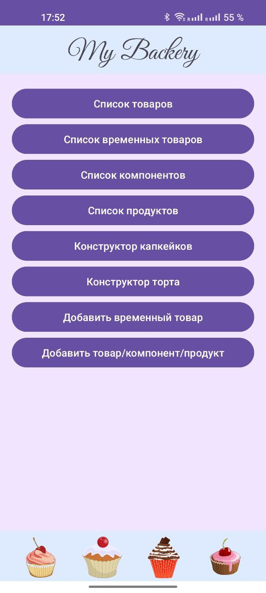
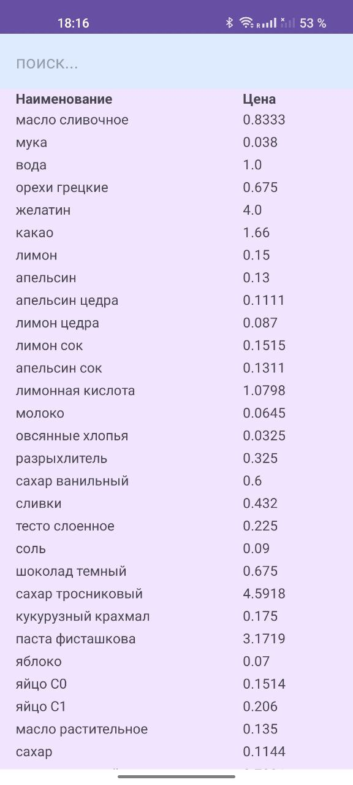
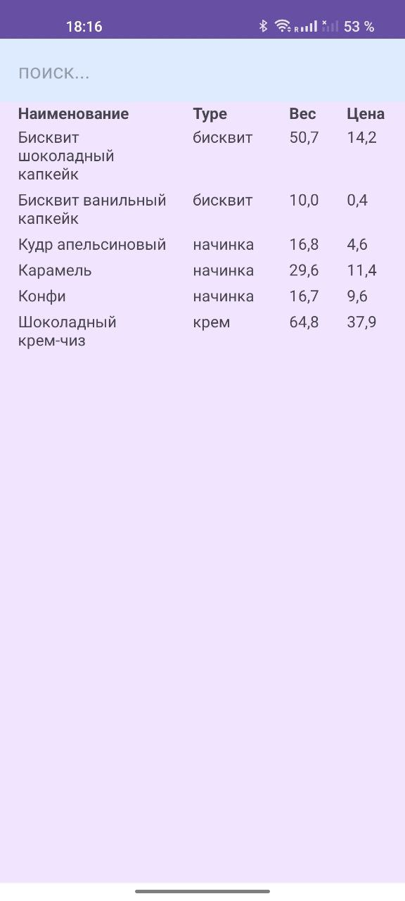
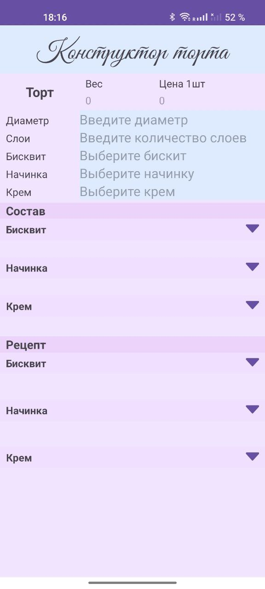

# Приложение для рецептов

## Функционал:
* связь с базой данной для получения информации о продуктах и рецептах
* отображение списка продуктов, компонентов, товаров
* конструктор определенных товаров из компонентов, учитвая необходимое количество
* добавление/удаление/изменение в базе данных через приложение

